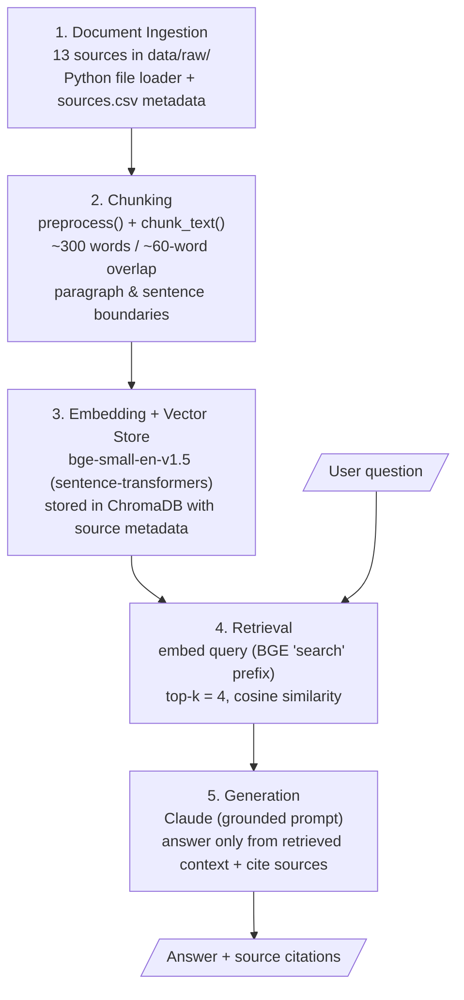

# Project 1 Planning: The Unofficial Guide

> Write this document before you write any pipeline code.
> Your spec and architecture diagram are what you'll use to direct AI tools (Claude, Copilot, etc.) to generate your implementation — the more specific they are, the more useful the generated code will be.
> Update the Retrieval Approach and Chunking Strategy sections if you change your approach during implementation.
> Update this file before starting any stretch features.

---

## Domain

<!-- What domain did you choose? Why is this knowledge valuable and hard to find through official channels? -->
I chose the International Student Career Survival Guide as my domain because international students often struggle to find career advice that addresses their specific experiences. Although official resources provide useful information, it is usually spread across multiple websites and focuses more on policies than real-world guidance. In my experience, some of the most helpful advice came from other international students through Reddit, career webinars, and communities such as CodePath, ColorStack, and Rewriting the Code. This project will make that knowledge easier to search and access by bringing it together in one place.
---

## Documents

<!-- List your specific sources: URLs, subreddit names, forum threads, or file descriptions.
     Aim for at least 10 sources that together cover different subtopics or perspectives within your domain. -->

| # | Source | Description | URL or location |
|---|--------|-------------|-----------------|
| 1 | How I Survived the Toughest Job Market as an International Student | International student internship search experience, application volume, recruiting challenges, sponsorship concerns | https://www.reddit.com/r/internships/comments/1jpcszv/how_i_survived_the_toughest_job_market_as_an/ |
| 2 | Advice for International Students in the US | Career advice, networking, recruiting mistakes, internship strategy, long-term planning | https://www.wallstreetoasis.com/forum/investment-banking/advice-for-international-students-in-the-us-f-1-visa-opt-cpt-h-1b |
| 3 | I'm an international student at UNC. Here's how I got an AI summer internship. | Personal success story, networking, projects, internship search strategy | https://www.businessinsider.com/unc-student-landed-internship-after-changing-major-2026-4 |
| 4 | Want to land a tech internship? A Google engineer explains how networking 'intentionally' can help | Projects, networking, interview preparation, internship recruiting | https://www.businessinsider.com/google-engineer-advice-internship-tech-job-offer-2025-6 |
| 5 | No Internship? No Problem | Advice for leveling-up your resume if you didn't land a summer internship | data/raw/source_05.txt |
| 6 | How to Add Projects to Your Resume (And Actually Get Credit for Them) | How to add projects to your resume | https://rewritingthecode.org/resources/member-resources/how-to-add-projects-to-your-resume/ |
| 7 | Building Confidence: Empower Yourself as a Woman in Tech | Building confidence in your career | https://rewritingthecode.org/resources/member-resources/building-confidence-empower-yourself-as-a-woman-in-tech/ |
| 8 | Google Early Careers Session Notes | Tips from a Google recruiter and Nooglers | data/raw/source_08.txt |
| 9 | Squarespace Acing Technical Recruitment Info Session | Tips from a Squarespace recruiter and two SWE recent grads | data/raw/source_09.txt |
| 10 | How to Ace the First 30 Days of Your New Job | Thriving in your new job during the first 30 days | https://rewritingthecode.org/resources/member-resources/how-to-ace-the-first-30-days/ |
| 11 | Underclassmen Opportunities | A resource for finding underclassmen career opportunities | https://github.com/Jose-Gael-Cruz-Lopez/underclassmen-opportunities/tree/main?tab=readme-ov-file |
| 12 | Google's AI-Assisted Coding Interview (2026 Guide) | A guide on Google's AI-assisted coding interview | https://www.tryexponent.com/blog/google-ai-coding-interview |
| 13 | Using AI in Meta's AI-assisted coding interview (with real prompts and examples) | A guide on Meta's AI-assisted coding interview | https://interviewing.io/blog/how-to-use-ai-in-meta-s-ai-assisted-coding-interview-with-real-prompts-and-examples |

---

## Chunking Strategy

**Chunk size: target ~300 words per chunk (hard cap ~380 words, ≈490 tokens, with the ~60-word overlap counted inside the cap so no chunk exceeds the embedding model’s 512-token limit). I split on natural boundaries — paragraph/blank-line breaks for prose, and sentence boundaries where no paragraphs exist — grouping consecutive units until the word budget is reached. Short documents may form a single chunk; long ones are split into several.**

**Overlap: ~60 words (roughly 1–2 sentences) between adjacent chunks. I define overlap by word count rather than "one paragraph" because paragraph lengths vary widely across my sources, and several sources have no paragraph structure at all.**

**Preprocessing (before chunking): My sources are not uniformly clean prose, so I normalize them first:

Strip any leftover HTML tags and unescape HTML entities (e.g. "&lt;", "</code>" from code snippets in the AI-interview articles), removing tags before unescaping so escaped angle brackets inside code survive.
Strip boilerplate/navigation text from scraped pages (e.g., the GitHub source had "Skip to content", "Pull requests", "Insights" chrome).
Rejoin the clause-per-line transcripts (Google and Squarespace info-session notes) into full sentences before chunking, since they contain no blank-line paragraph breaks.
Collapse slide-deck fragments (the "No Internship? No Problem" PDF) into coherent sentences/bullets.
Normalize whitespace and remove empty lines.**

**Reasoning: My corpus mixes genuine prose (Reddit posts, forum threads, career articles, ~600–1,300 words each) with two large transcripts (~6,000+ words), a scraped repo page, and slide-deck text. Each prose document covers several subtopics (networking, internships, sponsorship, resumes, interviews), so I chunk by topic-coherent groups rather than a blind character split, keeping related ideas together. Since my two largest sources (the transcripts) have no paragraph breaks, I use a word/token budget as the primary splitter and treat paragraph/sentence boundaries as preferred cut points. This keeps chunks under the 512-token limit of common embedding models so none get silently truncated, and the ~60-word overlap preserves context across boundaries.**

---

## Retrieval Approach

<!-- Which embedding model are you using (e.g., all-MiniLM-L6-v2 via sentence-transformers)?
     How many chunks will you retrieve per query (top-k)?
     If you were deploying this for real users and cost wasn't a constraint, what tradeoffs
     would you weigh in choosing a different embedding model — context length, multilingual
     support, accuracy on domain-specific text, latency? -->

**Embedding model: bge-small-en-v1.5 (via sentence-transformers).** I chose this over all-MiniLM-L6-v2 because MiniLM truncates inputs at 256 tokens, which would silently cut off my ~300-word chunks; bge-small-en-v1.5 supports up to 512 tokens, matching my chunk size, while remaining small, fast, and free to run locally. Both are English-only, which fits my corpus since all 13 sources are in English.**

**Top-k: 4. With roughly 50–90 small, topic-coherent chunks in my corpus, retrieving 4 gives the model enough supporting context to answer without flooding the prompt with off-topic chunks. I will revisit this during evaluation and raise it to 5–6 if answers feel under-supported.**

**Production tradeoff reflection: If I were deploying this for real users and cost was not a constraint, I would evaluate stronger models such as bge-large-en-v1.5 for better English retrieval accuracy, or API-hosted models like OpenAI text-embedding-3-large and Cohere embed-v3 for higher accuracy and longer context. Because my users are international students who may search in their first language, I would also consider a multilingual model such as paraphrase-multilingual-MiniLM-L12-v2, even though my current sources are all English. For nuanced career advice where the same idea is phrased many different ways, I would likely add a cross-encoder re-ranker (e.g., Cohere Rerank) on top of the initial retrieval to reorder results by relevance. The tradeoffs are increased latency, infrastructure complexity, per-call cost, and sending data off-device, in exchange for more accurate retrieval.**

---

## Evaluation Plan

<!-- List your 5 test questions with their expected correct answers.
     Questions should be specific enough that you can judge whether the system's response
     is right or wrong. "What are good dining halls?" is too vague.
     "What do students say about wait times at [dining hall name] during lunch?" is testable. -->

| # | Question | Expected answer |
|---|----------|-----------------|
| 1 | What advice did a Squarespace recruiter give students without prior SWE internships who are applying for new grad roles? | Tech-adjacent experience can still be valuable. Projects, hackathons, leadership positions, clubs, and other relevant experiences can help demonstrate skills and initiative. |
| 2 | What building blocks were recommended for overcoming self-doubt? | Self-awareness, self-trust, resilience, growth mindset, self-compassion, and commitment. |
| 3 | What resume formula was recommended for writing project bullet points? | [Action Verb] + [What You Did] + [Technology Used] + [Measurable Result] |
| 4 | What strategies did new graduate software engineers recommend for improving at LeetCode? | Paying attention in data structures and algorithms courses, explaining solutions out loud, doing mock interviews, and comparing brute-force solutions to optimized approaches. |
| 5 | What are common reasons international students are rejected from internships? | Sponsorship requirements and not meeting job qualifications are frequently cited reasons. |

---

## Anticipated Challenges

<!-- What could go wrong? Name at least two specific risks with reasoning.
     Consider: noisy or inconsistent documents, missing source attribution, off-topic
     retrieval, chunks that split key information across boundaries. -->

1. **Noisy, inconsistently formatted sources degrading embeddings.** My corpus is not uniform clean prose: the Google and Squarespace info-session notes are transcribed one clause per line with no paragraphs, the "No Internship? No Problem" source is fragmented slide-deck text, and the Underclassmen Opportunities source is a scraped GitHub page full of navigation chrome ("Skip to content", "Pull requests", "Insights"). If my preprocessing doesn't clean and rejoin these properly, chunks will contain broken sentences and boilerplate, which produces weak embeddings and pulls irrelevant chunks into retrieval. Mitigation: the preprocessing step in my Chunking Strategy (strip boilerplate, rejoin clause-per-line transcripts, collapse slide fragments, normalize whitespace) before chunking.

2. **Key information split across chunk boundaries.** Several of my expected answers are short, self-contained lists or formulas — e.g., the resume bullet formula "[Action Verb] + [What You Did] + [Technology Used] + [Measurable Result]" (Q3) and the six "building blocks for overcoming self-doubt" (Q2). If a chunk boundary falls in the middle of such a list, retrieval may return only half of it and the model will give an incomplete answer. Mitigation: a ~60-word overlap between chunks and preferring sentence/paragraph boundaries as split points, so list items are less likely to be cut apart.

3. **Off-topic retrieval from overlapping subtopics.** Many of my sources cover the same themes (networking, internships, interview prep, resumes), so a query meant for one source can surface a similar-sounding chunk from another — e.g., "What advice did a *Squarespace* recruiter give?" (Q1) could retrieve the *Google* Early Careers session notes instead, since both discuss new-grad hiring advice. This hurts both accuracy and source attribution. Mitigation: keeping chunks topic-coherent, storing source metadata with each chunk so responses can cite the correct document, and revisiting top-k during evaluation if the wrong source is being pulled.

---

## Architecture

<!-- Draw a diagram of your pipeline showing the five stages:
     Document Ingestion → Chunking → Embedding + Vector Store → Retrieval → Generation
     Label each stage with the tool or library you're using.
     You can use ASCII art, a Mermaid diagram, or embed a sketch as an image.
     You'll use this diagram as context when prompting AI tools to implement each stage. -->

Pipeline: **Document Ingestion → Chunking → Embedding + Vector Store → Retrieval → Generation.** The user's question enters at the Retrieval stage, where it is embedded and matched against the stored chunks; the top-k results are passed to Generation, which answers using only that context and cites its sources.

---

## AI Tool Plan

<!-- For each part of the pipeline below, describe:
     - Which AI tool you plan to use (Claude, Copilot, ChatGPT, etc.)
     - What you'll give it as input (which sections of this planning.md, which requirements)
     - What you expect it to produce
     - How you'll verify the output matches your spec

     "I'll use AI to help me code" is not a plan.
     "I'll give Claude my Chunking Strategy section and ask it to implement chunk_text()
     with my specified chunk size and overlap" is a plan. -->

**Milestone 3 — Ingestion and chunking:** I will use Claude (in Claude Code) for this milestone. *Input:* my Documents table (so it knows the file formats — clean articles, clause-per-line transcripts, slide-fragment PDF, scraped GitHub page) and my full Chunking Strategy section, including the preprocessing rules and the ~300-word target / ~60-word overlap. *Expected output:* a `load_documents()` function that reads each file in `data/raw/` and attaches source metadata (id, title, URL) from `sources.csv`, a `preprocess()` function that strips boilerplate, rejoins clause-per-line transcripts, collapses slide fragments, and normalizes whitespace, and a `chunk_text()` function that splits on paragraph/sentence boundaries up to the word budget with overlap. *Verification:* I will print the chunk count and inspect sample chunks from a transcript (source_08/09), the slide PDF (source_05), and the GitHub page (source_11) to confirm boilerplate is gone, chunks are coherent, and none exceed the ~512-token limit before embedding.

**Milestone 4 — Embedding and retrieval:** I will use Claude. *Input:* my Retrieval Approach section, specifying `bge-small-en-v1.5` via sentence-transformers, top-k = 4, and the note that BGE benefits from prefixing queries with "Represent this sentence for searching relevant passages:". *Expected output:* an `embed_chunks()` function that encodes all chunks and stores them with their source metadata in a vector store (e.g., FAISS or Chroma), and a `retrieve(query, k=4)` function that embeds the query and returns the top-k chunks with similarity scores and source attribution. *Verification:* I will run my 5 evaluation questions through `retrieve()` and check that the top chunks come from the expected source (e.g., Q1 → Squarespace source_09, not the Google notes) and contain the ground-truth information.

**Milestone 5 — Generation and interface:** I will use Claude. *Input:* my Grounded Generation requirements, the retrieval function from Milestone 4, and my 5 evaluation questions. *Expected output:* a `generate_answer(query)` function that retrieves top-k chunks, formats them into a grounded prompt with a system instruction to answer only from the provided context and cite sources (and say it doesn't know when the context is insufficient), calls the LLM, and returns the answer with source citations — plus a simple CLI or notebook interface to ask questions. *Verification:* I will run all 5 evaluation questions, compare the responses against my ground-truth answers, confirm citations point to the correct source, and test an out-of-domain question to make sure the system declines rather than hallucinating.
